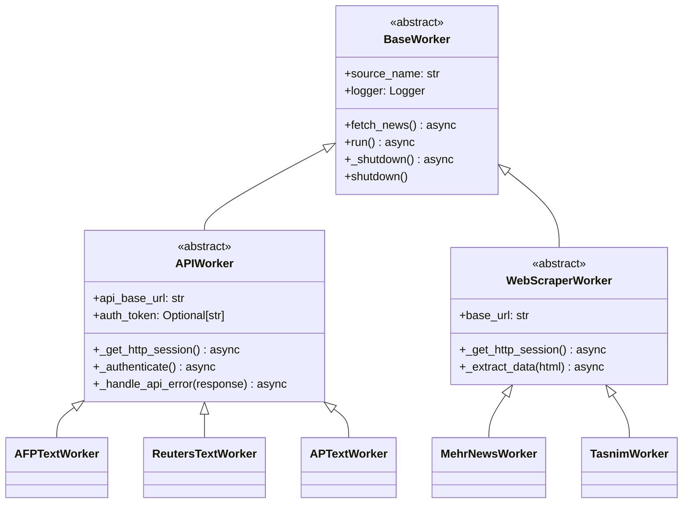

# News Scraping Platform - Code Structure Improvement Plan

## Current State Analysis

### Strengths
- Well-structured project with clear separation between sources, workers, API, and database
- Consistent use of async/await pattern across all workers
- Good logging implementation with structured logging
- Rate limiting implemented via `RateLimiter` class
- Base worker class provides common functionality

### Issues Identified

#### 1. **Inconsistent Initialization Patterns**
- Some workers load environment variables directly in `__init__`
- Others use helper functions like `_clean_env()`
- Environment variable loading happens in multiple places

#### 2. **Duplicate Code**
- HTTP session management is duplicated across workers
- Authentication patterns vary between workers
- Error handling is inconsistent
- Database operations are repeated with minor variations

#### 3. **Missing Abstractions**
- No common base class for API-based workers
- No common base class for web scraping workers
- No standardized way to handle pagination
- No consistent pattern for article parsing

#### 4. **Configuration Management**
- Environment variables are loaded in each worker file
- No centralized configuration validation
- Settings are scattered across different files

#### 5. **Testing Challenges**
- Workers are tightly coupled to database and HTTP clients
- No clear separation between business logic and I/O operations
- Mocking is difficult due to tight coupling

## Proposed Architecture

### 1. Enhanced Base Worker Hierarchy



### 2. Configuration Management

Create a centralized configuration loader:

```python
class WorkerConfig:
    def __init__(self, source_name: str):
        self.source_name = source_name
        self.config = self._load_config()
        
    def _load_config(self) -> Dict[str, Any]:
        """Load and validate configuration for a specific worker."""
        pass
        
    def get(self, key: str, default: Any = None) -> Any:
        """Get configuration value with validation."""
        pass
```

### 3. HTTP Client Abstraction

```python
class HTTPClient:
    def __init__(self, source_name: str, headers: Optional[Dict] = None):
        self.source_name = source_name
        self.headers = headers or {}
        self.session: Optional[aiohttp.ClientSession] = None
        
    async def get(self, url: str, **kwargs) -> aiohttp.ClientResponse:
        pass
        
    async def post(self, url: str, **kwargs) -> aiohttp.ClientResponse:
        pass
        
    async def close(self) -> None:
        pass
```

### 4. Database Service Layer

```python
class NewsRepository:
    @staticmethod
    async def get_by_url(url: str) -> Optional[News]:
        pass
        
    @staticmethod
    async def save(news: News) -> bool:
        pass
        
    @staticmethod
    async def update(news: News) -> bool:
        pass
```

### 5. Article Processing Pipeline

```python
class ArticleProcessor:
    def __init__(self, source_name: str):
        self.source_name = source_name
        
    def normalize_category(self, raw_category: str) -> Tuple[str, str]:
        pass
        
    def build_body_html(self, article_data: Dict) -> str:
        pass
        
    def create_news_object(self, article_data: Dict) -> News:
        pass
```

## Implementation Plan

### Phase 1: Foundation (High Priority)

1. **Create abstract worker classes**
   - `APIWorker` for API-based sources
   - `WebScraperWorker` for web scraping sources
   - Move common HTTP session management to base classes

2. **Implement HTTPClient abstraction**
   - Centralize HTTP session management
   - Add retry logic with exponential backoff
   - Implement circuit breaker pattern

3. **Create NewsRepository**
   - Abstract all database operations
   - Add transaction management
   - Implement caching layer for common queries

### Phase 2: Refactoring (Medium Priority)

1. **Refactor existing workers**
   - Update AFP, Reuters, AP workers to use `APIWorker`
   - Update Persian news workers to use `WebScraperWorker`
   - Remove duplicate code

2. **Implement ArticleProcessor**
   - Standardize article processing logic
   - Handle HTML generation consistently
   - Implement category normalization

3. **Enhance configuration management**
   - Create `WorkerConfig` class
   - Validate environment variables
   - Add configuration schema validation

### Phase 3: Testing & Quality (Low Priority)

1. **Add unit tests**
   - Test HTTPClient with mock responses
   - Test NewsRepository with test database
   - Test ArticleProcessor with sample data

2. **Add integration tests**
   - Test worker lifecycle
   - Test error handling
   - Test rate limiting

3. **Add documentation**
   - Document worker creation pattern
   - Document configuration requirements
   - Document testing approach

## Benefits

1. **Reduced Code Duplication**: ~30-40% reduction in code through shared abstractions
2. **Improved Maintainability**: Changes to common functionality only need to be made once
3. **Better Testability**: Clear separation of concerns makes mocking easier
4. **Consistent Behavior**: All workers follow the same patterns
5. **Easier Onboarding**: New developers can understand the structure quickly
6. **Reduced Bugs**: Centralized error handling and validation

## Migration Strategy

1. **Incremental Refactoring**: Refactor one worker at a time
2. **Backward Compatibility**: Ensure old and new code can coexist during transition
3. **Feature Flags**: Use configuration to switch between old and new implementations
4. **Testing**: Add tests for each refactored worker before deployment
5. **Monitoring**: Add metrics to track worker performance after refactoring

## Risks & Mitigation

| Risk | Mitigation Strategy |
|------|---------------------|
| Breaking existing functionality | Incremental refactoring with tests |
| Performance degradation | Benchmark before and after changes |
| Increased complexity | Keep abstractions simple and focused |
| Resistance to change | Document benefits clearly, involve team in design |

## Next Steps

1. Create the enhanced base worker hierarchy
2. Implement HTTPClient abstraction
3. Create NewsRepository
4. Refactor one worker (e.g., AFPTextWorker) as a proof of concept
5. Review and adjust based on feedback
6. Continue refactoring remaining workers
